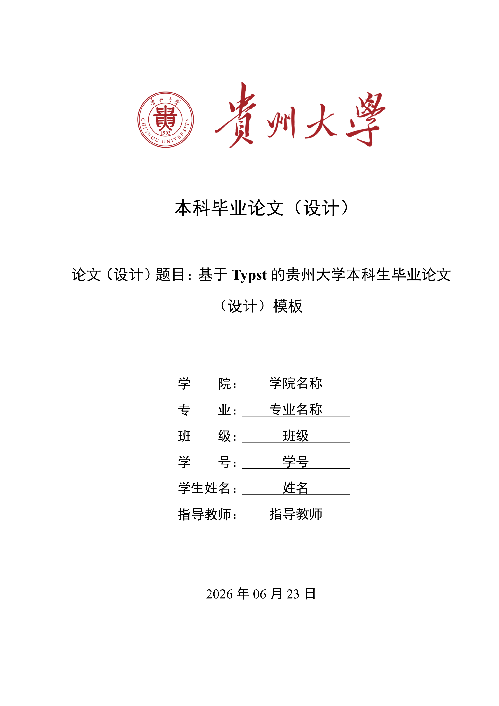

# 贵州大学本科生毕业论文（设计）模板

## 模板介绍
此模板参考
[《贵州大学毕业论文（设计）管理办法（试行）》（2025 年 4 月）](assets/贵州大学毕业论文（设计）管理办法（试行）.pdf)
制作。

## 使用方法
可在官方网页端在线使用，只需在仪表板上点击 “Start from template”，
然后搜索 gzu-thesis。

另外，你也可以在本地使用下面的命令来启动这个项目。
```bash
typst init @preview/gzu-thesis
```
Typst 将会创建一个新的目录，其中包含此模板的一套示例，可阅读代码了解使用方法，
关于此模板的更多内容可查看 [模板手册](manual.pdf)

## 模板预览


## 存在的问题
目前存在参考文献超过三位作者时，中英文文献均会统一用“等”省略后续作者，
无法智能地在英文条目中使用“et al”。此问题源自于 Typst
现在还未支持多语言参考文献，暂时没有比较优雅的解决方式。
